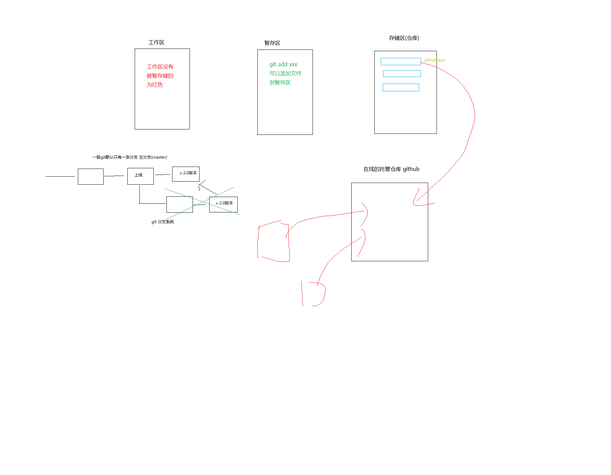

# 笔记

## 二级标题

### 三级标题

在 Markdown 中段落由一行或者多行文本组成，相邻的两行文字会被视为同一段落
如果存在空行则被视为不同段落( Markdown 对空行的定义是看起来是空行就是空行，

第一行  
上一行结尾存在两个空格，段内换行

_倾斜_

**粗体**

~~删除线~~

> 引用一段文字




[百度](https://www.baidu.com/)

### 常见标签

-   head 标签
    -   meta
        -   name
        -   charset
        -   content

---

---

\*HI\*

行内`代码`代码

代码块

```html
<ul class="fa-ul">
	<li><i class="fa-li fa fa-check-square"></i>List icons</li>
	<li><i class="fa-li fa fa-check-square"></i>can be used</li>
	<li><i class="fa-li fa fa-spinner fa-spin"></i>as bullets</li>
	<li><i class="fa-li fa fa-square"></i>in lists</li>
</ul>
```

| 默认 | 靠右 | 居中 | 靠左 |
| ---- | ---: | :--: | :--- |
| 内容 | 内容 | 内容 | 内容 |
| 内容 | 内容 | 条目 | 内容 |
